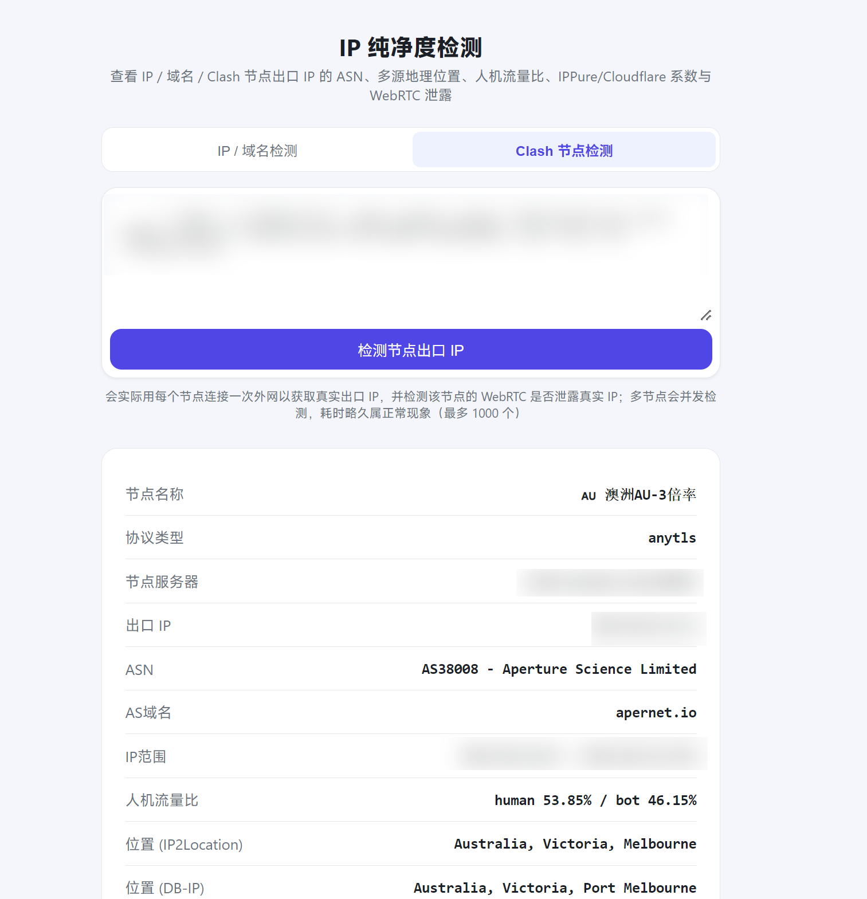

# IP Purity Detector

**[🇨🇳 中文文档 »](README.md)**

Give it an IP / domain / Clash proxy node config, and it checks the **purity** of the
resulting egress IP. It drives a real headless browser to open
`https://ippure.com/?ip=x.x.x.x` and scrapes the full report shown on that page (matching
exactly what ippure.com itself displays):

- **ASN / AS domain / IP range / human-vs-bot traffic ratio**
- **Geolocation** as judged by Cloudflare / IP2Location / DB-IP / MaxMind / IPInfo.io /
  Bilibili and others
- **IP source** and **IP attribute** (e.g. native IP vs. datacenter IP)
- **IPPure score** and **Cloudflare score** (two independent risk-scoring systems)
- **WebRTC leak detection**

Three ways to use it: Web UI, HTTP API, and a CLI (`cli.py`). IP/domain and Clash-node
lookups both support single and batch queries (up to 1000 each), and a batch item returns
exactly the same amount of detail as a single query. Both the Web UI and the CLI show a
live progress bar (completed/total) during batch runs, so you're not left waiting blind
until everything finishes.

## Quick start

```bash
git clone https://github.com/CharlesGool/ip-purity-detector.git
cd ip-purity-detector
docker compose up -d --build
```

Open `http://<server-IP>:8000` in a browser, switch between the "IP / Domain Detection"
and "Clash Node Detection" tabs, paste in the IP / domain you want to check (or a Clash
node config), and hit the detect button. Within a few seconds to a few tens of seconds
you'll get the full report — ASN, multi-source geolocation, human-vs-bot traffic ratio,
IPPure / Cloudflare purity scores, WebRTC leak status, etc. Here's what that looks like
(Clash node detection example, sensitive fields blurred out):



For batch checks (paste multiple IPs/domains or nodes at once, up to 1000 each), the
`cli.py` CLI, and the HTTP API, see "CLI tool" / "API reference" below. Deploying on a
brand-new machine for the first time? See "Deploying from scratch on a brand-new Linux
machine" below.

## Why a headless browser instead of calling the API directly

ippure.com's data endpoint is signed/encrypted (HMAC + AES) to stop scripts from calling
it directly, and the logic lives inside obfuscated front-end JS — reverse-engineering it
would be costly and would break every time their front end changes. Instead, this tool
opens the page with Chromium like a real user would, waits for the page's own requests to
finish rendering, clicks the "show extended info" button on the page, then reads the
result from a set of stable CSS classes (`info-key` / `info-value` /
`colormap-indicator-value` / `geo-source` / `ip-subtitle`, etc). That's more stable and
maintainable than reverse-engineering their API.

## How Clash node detection works

Rather than reimplementing VLESS / Trojan / Reality and every other protocol — which
would be both complex and fragile — this tool calls
[mihomo](https://github.com/MetaCubeX/mihomo) directly (the official rebrand of Clash
Meta, and the open-source Clash core with the broadest protocol support and most active
development):

1. The pasted single-node config is wrapped into a temporary mihomo config file, which
   spins up a local mixed-proxy port.
2. That local port is used to hit an IP-echo service (`api.ipify.org`, etc.), giving the
   real public IP traffic exits through when routed via this node.
3. That egress IP is fed into the same ippure.com detection pipeline described above.
4. A separate browser context, configured to route through that node's local proxy port
   (SOCKS5), separately visits ippure.com specifically to check whether the node's tunnel
   can be bypassed via WebRTC, leaking the real IP (the `disable_non_proxied_udp` policy
   forces WebRTC through the configured proxy; if it can't, that's treated as "no usable
   proxy channel" rather than a false-positive leak).
5. The mihomo subprocess is killed and its temp directory cleaned up immediately after
   detection finishes.

In theory, every protocol mihomo supports (vless/vmess/trojan/ss/hysteria2/reality/
anytls/...) works out of the box — no need to maintain parsing logic per protocol
ourselves.

Node parsing is somewhat tolerant of messy pasted input: it first tries standard YAML
parsing, and if that fails due to inconsistent indentation (e.g. pasting nodes from
several different sources with different indentation habits), it falls back to extracting
each `{ ... }` flow-style node individually — no need to manually clean up indentation.

## Running locally (already deployed)

The code lives at `/root/ipdetect/` and has been verified to build with Docker. Listens
on port `8000` by default.

```bash
cd /root/ipdetect
docker compose up -d --build
```

Then open `http://<this-machine's-IP>:8000` in a browser.

## Deploying from scratch on a brand-new Linux machine

Assuming a clean server/VM (using Ubuntu/Debian as the example) with neither Docker nor
this code installed yet, here's the full walkthrough:

### 1. Install Docker

Use the official install script — works across mainstream distros
(Ubuntu/Debian/CentOS/Fedora, etc.):

```bash
curl -fsSL https://get.docker.com | sh
sudo systemctl enable --now docker
```

Verify it installed correctly and that it comes with the newer built-in `docker compose`
(not the legacy standalone `docker-compose` command):

```bash
docker --version
docker compose version
```

If `docker compose version` says "command not found," the installed version didn't
include the compose plugin — see the
[official Docker docs](https://docs.docker.com/compose/install/) to install it
separately.

(Optional) Add the current user to the `docker` group so you don't need `sudo` on every
command:

```bash
sudo usermod -aG docker $USER
newgrp docker   # or log out and back in for the group change to take effect
```

### 2. Pull the code from GitHub

Most distros ship with `git`; if not, install it first (`sudo apt install -y git` or your
distro's package manager):

```bash
git clone https://github.com/CharlesGool/ip-purity-detector.git
cd ip-purity-detector
```

### 3. Build and start

```bash
docker compose up -d --build
```

The first build automatically installs Chromium (via Playwright) and mihomo inside the
image — no extra steps needed, though it may take a few minutes depending on your network
speed.

### 4. Access it

Open `http://<this-server's-IP>:8000` in a browser. On a cloud server, remember to allow
port `8000` through your security group/firewall (`ufw`, etc.). If you'd rather not
expose that port directly, change `ports` in `docker-compose.yml` to bind to localhost
only (`"127.0.0.1:8000:8000"`) and put a reverse proxy in front of it.

### 5. Common operational commands

```bash
docker compose logs -f          # tail live logs
docker compose ps               # check container status
docker compose down             # stop the service (does not remove code or images)
```

To update the code later:

```bash
git pull
docker compose up -d --build    # rebuild the image and restart the container
```

### Changing the port

Port `8000` is exposed by default. To change it, edit the `ports` mapping in
`docker-compose.yml` — e.g. change `"8000:8000"` to `"9000:8000"` (host port 9000, still
port 8000 inside the container).

### Running without Docker (works, but not recommended)

```bash
cd ipdetect
python3 -m venv venv
source venv/bin/activate
pip install -r requirements.txt
playwright install --with-deps chromium   # installs the browser and its system deps
scripts/fetch_mihomo.sh ./bin/mihomo      # installs mihomo, needed for Clash node detection
uvicorn main:app --host 0.0.0.0 --port 8000
```

## CLI tool

`cli.py` is a thin client that talks HTTP to an already-running service (local or
remote), reusing its already-warmed-up browser/mihomo instances instead of starting fresh
each time.

```bash
# Install dependencies (if not in the venv, you at least need requests)
pip install requests

# Check a single IP / domain
python3 cli.py ip 8.8.8.8
python3 cli.py ip example.com --json          # print raw JSON

# Check multiple IPs / domains (one per line or comma-separated — any of these 3 work)
python3 cli.py ip "8.8.8.8, example.com, 1.1.1.1"
python3 cli.py ip -f targets.txt              # one per line in a file
cat targets.txt | python3 cli.py ip           # piped input

# Check a Clash node (single or batch — any of these 3 work)
python3 cli.py node "- { name: 'sg', type: vless, server: 1.2.3.4, port: 443, ... }"
python3 cli.py node -f nodes.yaml          # file can hold one node or a full node list
cat nodes.yaml | python3 cli.py node       # both single and batch print the full detail view, batch just prints each in turn

# Connect to a remotely deployed service
python3 cli.py ip 8.8.8.8 --url http://192.168.1.10:8000
# or: export IPDETECT_URL=http://192.168.1.10:8000
```

Note that `--url` / `--json` / `--timeout` must come **after** the subcommand
(`ip`/`node`) — `cli.py ip 8.8.8.8 --json` works, `cli.py --json ip 8.8.8.8` doesn't.

For large batches, terminal output gets long — prefer `--json` piped into a script/`jq`
rather than scrolling through it manually.

Batch checks (when `ip`/`node` are given multiple targets) show a live progress bar in
the terminal (`Progress [###---] 3/10`), written to stderr so it doesn't interfere with
`--json` or table output; it's automatically suppressed in non-terminal contexts
(pipes/redirects).

## API reference

### Check a single IP / domain

```
POST /api/detect
Content-Type: application/json

{ "target": "8.8.8.8" }        // or a domain, e.g. "example.com"
```

Response:

```json
{
  "input": "8.8.8.8",
  "resolved_ip": "8.8.8.8",
  "ip_source": "Native IP",
  "ip_attribute": "Datacenter IP",
  "ippure_score": 7,
  "ippure_label": "Extremely Pure",
  "ippure_raw": "7% Extremely Pure",
  "cloudflare_score": 15,
  "cloudflare_label": "Pure",
  "cloudflare_raw": "15% Pure",
  "asn": "AS15169 - Google LLC",
  "as_domain": "google.com",
  "ip_range": "8.8.8.0 - 8.8.8.255",
  "human_pct": 2.66,
  "bot_pct": 97.34,
  "locations": {
    "IP2Location": "United States, California, Mountain View",
    "DB-IP": "United States, California, Mountain View",
    "MaxMind": "United States",
    "Bilibili": "GOOGLE.COM, GOOGLE.COM"
  },
  "webrtc_leak": { "leaked": false, "ip": null, "location": null }
}
```

- `resolved_ip`: if the input is a domain, this is the egress IP resolved via DNS; if the
  input is already an IP, it's returned as-is.
- Any of the fields above may be missing (`null`, or the key absent from `locations`) if
  ippure.com's underlying data source didn't return a value for it — the front end shows
  "unavailable" for these, it does not indicate an error.
- `webrtc_leak` here reflects whether **this service's own browser** leaked its IP (with
  no proxy configured, this is effectively always `false` thanks to the
  `disable_non_proxied_udp` policy) — it is not a property of the target IP being looked
  up. The `webrtc_leak` under node detection (below) is the meaningful one, measured
  through that node's actual tunnel.

### Batch-check multiple IPs / domains

```
POST /api/detect-batch
Content-Type: application/json

{ "targets": "8.8.8.8, example.com\n1.1.1.1" }
```

`targets` accepts a mix of newlines, half-width commas, and full-width commas as
separators, up to 1000 per request (over that limit returns 400). Runs concurrently
(bounded by `MAX_CONCURRENCY`, default 3); one failure doesn't affect the others:

```json
{
  "total": 3,
  "success_count": 2,
  "results": [
    { "input": "8.8.8.8", "resolved_ip": "8.8.8.8", "success": true, "...": "same full field set as a single lookup" },
    { "input": "example.com", "success": false, "error": "Failed to resolve domain: example.com" }
  ]
}
```

#### Streaming version (with progress): `/api/detect-batch-stream`

Same request body, but the response is `application/x-ndjson` (one JSON object per line,
instead of one big JSON blob at the end): as each item finishes, a progress line is
pushed immediately — `{"type": "progress", "done": N, "total": T, "index": i, "result":
{...}}` (`index` is the item's position in the original input, so clients can lay out
results in input order rather than completion order). Once everything finishes, a final
line is pushed — `{"type": "done", "total": T, "success_count": S, "results": [...]}` —
with `results` already sorted in input order, using the exact same fields as
`/api/detect-batch` above. Both the Web UI and `cli.py` drive their progress bars off
this endpoint.

### Check a single Clash node

```
POST /api/detect-node
Content-Type: application/json

{ "node": "- { name: 'sg', type: vless, server: 1.2.3.4, port: 443, uuid: ..., ... }" }
```

`node` can be: a single node in flow-style YAML (as above), a multi-line YAML node, or an
entire Clash config containing a `proxies:` list (in which case only the first node is
probed). Inconsistently indented pasted content is also parsed tolerantly.

Response (as full as `/api/detect`, plus the node's own info and its egress IP):

```json
{
  "node_name": "sg",
  "node_type": "vless",
  "node_server": "1.2.3.4",
  "node_port": 443,
  "egress_ip": "185.xx.xx.xx",
  "success": true,
  "ip_source": "Native IP",
  "ip_attribute": "Datacenter IP",
  "ippure_score": 12,
  "ippure_label": "Pure",
  "ippure_raw": "12% Pure",
  "cloudflare_score": 18,
  "cloudflare_label": "Pure",
  "cloudflare_raw": "18% Pure",
  "asn": "...", "as_domain": "...", "ip_range": "...",
  "human_pct": 80.1, "bot_pct": 19.9,
  "locations": { "...": "..." },
  "webrtc_leak": { "leaked": false, "ip": null, "location": null }
}
```

Here `webrtc_leak` is measured for real, through that node's own local proxy port: when
`leaked: true`, `ip`/`location` show the real IP and approximate location leaked via
WebRTC, meaning this node isn't suitable for hiding your real egress; `leaked: false`
means no bypass-the-tunnel leak was detected (it could also mean the node/protocol
doesn't support UDP forwarding, so WebRTC simply couldn't connect at all — conservatively
not counted as a leak in that case).

If the node can't be reached (server unreachable, handshake failure, missing protocol
parameters, etc.), a 502 is returned, with `detail` carrying mihomo's own specific error
message, e.g.:

```json
{ "detail": "Failed to reach the internet via this node: [TCP] dial PROXY ... connect error: context deadline exceeded" }
```

### Batch-check multiple Clash nodes

```
POST /api/detect-nodes
Content-Type: application/json

{ "nodes": "- { name: 'sg', ... }\n- { name: 'uk', ... }\n- { name: 'jp', ... }" }
```

`nodes` accepts a multi-line node list (YAML list, also accepts a full Clash config with
a `proxies:` key, in which case every node in it is probed). Up to 1000 per request
(`MAX_BATCH_NODES`), probed with concurrency bounded by `MAX_NODE_CONCURRENCY` (default
2); one node failing doesn't affect the others. Every result item carries a `success`
flag, and successful entries have exactly the same fields as a single-node check:

```json
{
  "total": 5,
  "success_count": 2,
  "results": [
    { "node_name": "uk", "node_type": "anytls", "node_server": "...", "node_port": 40251,
      "success": false, "error": "Failed to reach the internet via this node: ..." },
    { "node_name": "ar", "node_type": "anytls", "node_server": "...", "node_port": 40254,
      "egress_ip": "103.xx.xx.xx", "success": true,
      "ip_source": "Native IP", "ip_attribute": "Datacenter IP",
      "ippure_score": 81, "ippure_label": "Extremely Risky", "ippure_raw": "81% Extremely Risky",
      "cloudflare_score": 76, "cloudflare_label": "Extremely Risky", "cloudflare_raw": "76% Extremely Risky",
      "webrtc_leak": { "leaked": false, "ip": null, "location": null } }
  ]
}
```

#### Streaming version (with progress): `/api/detect-nodes-stream`

Same protocol as `/api/detect-batch-stream` (`application/x-ndjson`, a `progress` event
per line plus a final `done` event), just running node probes instead. Node detection
takes noticeably longer (20–40s each), so the progress bar is especially useful here.

Both Web UI pages ("IP / Domain Detection" and "Clash Node Detection") auto-detect
whether you gave one target or several: a single target shows one detail card; multiple
targets each get the same full detail card, stacked one after another (not a condensed
table).

## Known limitations

- Depends on ippure.com's availability and page structure — if they do a major redesign
  (changing class names), the selectors in `main.py`'s `EXTRACT_JS` / `WEBRTC_LEAK_JS`
  will need updating to match.
- Defaults to at most 3 concurrent browser requests (`MAX_CONCURRENCY`) and at most 2
  concurrent node probes (`MAX_NODE_CONCURRENCY`), to avoid saturating machine resources;
  raise these by editing the constants near the top of `main.py` if needed.
- A single IP/domain check takes roughly 3–5 seconds; node checks take 20–40 seconds
  because they wait on a real handshake/timeout plus a WebRTC tunnel check. Batch checks
  run concurrently, so total time is roughly
  `count / concurrency × per-item time` — that's expected, not a bug.
- Batch checks (IP/domain or Clash node) are capped at 1000 per request; going over
  returns an error immediately rather than being auto-chunked. For large counts, the web
  page will render a very long stacked list — prefer the CLI's `--json` output piped into
  a script instead.
- The Cloudflare score is scored dynamically per session — scores for the same IP will
  fluctuate a bit across repeated checks; that's normal, not detection instability.
- Node WebRTC leak detection depends on the node/mihomo supporting UDP forwarding (the
  node config usually needs `udp: true`); when unsupported, it's conservatively reported
  as "no leak detected" rather than as an error.
